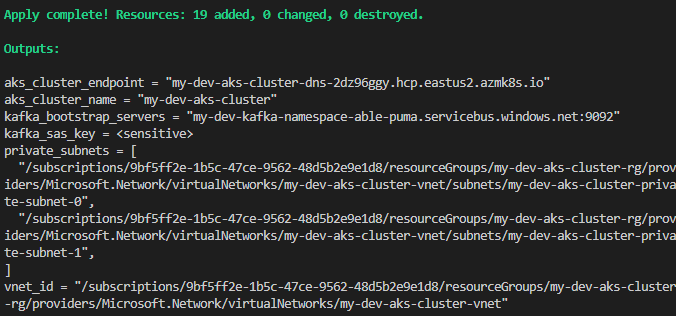
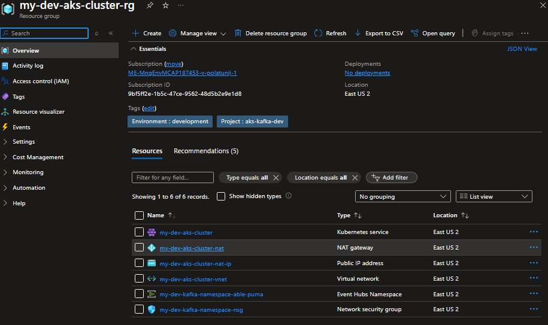

# 🚀 Terraform Azure Infrastructure (AKS + Kafka)

This project provisions Azure infrastructure using Terraform. It currently deploys:

- Azure Kubernetes Service (AKS)
- Azure Event Hubs (Kafka-compatible)
- Virtual Network and Subnet

---

## 📸 Architecture Overview

> _You can insert your infrastructure diagram below_




---

## 📂 Planned Directory Structure

> _This is the structure this project is evolving toward as modularization continues._

```

terraform/
├── modules/
│   ├── network/   # VNet, Subnet, NSG, NAT Gateway (to be added)
│   ├── aks/       # Kubernetes cluster (to be added)
│   └── kafka/     # Event Hub Kafka resources (to be added)
├── env/
│   └── dev/       # Environment-specific configuration (partially implemented)
└── provider.tf    # Provider configuration (backend not yet enabled)

```

---

## ☁️ Components Created

This version of the project provisions the following:

- AKS Cluster with default node pool
- Kafka-compatible Event Hub Namespace + Topic
- VNet and subnet for cluster connectivity

> _Remote Terraform backend and full module separation are planned for future iterations._

---

## ⚙️ Deployment Instructions

### 1. 📦 Prerequisites

- Azure CLI logged in (`az login`)
- Terraform CLI (`>= 1.4`)
- Service Principal credentials or `az login` session

---

### 2. 🧱 Initialize + Apply

```bash
cd terraform/env/dev

terraform init
terraform plan -out=tf.plan
terraform apply tf.plan
```

---

## 🐛 Troubleshooting & Error Log

Below is a full catalog of errors encountered during deployment:

---

### 1. ❌ `Attribute not expected here`

**Cause**: Misuse of `enable_auto_scaling`, `spot_max_price`, or `kafka_enabled`.
**Fix**: Moved invalid attributes to a separate node pool block or corrected syntax from registry examples like:

```hcl
node_labels = {
  "node-type" = "spot"
}
```

---

### 2. 🔐 `AADSTS900023: tenant_id is not valid`

**Cause**: Used placeholder tenant ID (`your_tenant_id`).
**Fix**: Removed hardcoded credentials, used `.env` or `az login` to authenticate.

---

### 3. ⚠️ `K8sVersionNotSupported`

**Cause**: Used unsupported version (`1.28.15`).
**Fix**: Changed to supported version with:

```bash
az aks get-versions --location eastus --output table
```

---

### 4. 🔄 `Saved plan is stale`

**Cause**: Terraform state changed after plan was saved.
**Fix**:

```bash
terraform plan -out=tf.plan
terraform apply tf.plan
```

Or simply:

```bash
terraform apply
```

---

### 5. 🚫 `VM size not allowed in location`

**Cause**: Chosen size not available or quota exceeded in region.
**Fix**: Switched to a different region.

---

### 6. 🔁 `Provider produced inconsistent result after apply`

**Cause**: Azure resource wasn't fully ready before Terraform read it.
**Fix**: Used `depends_on` for resource order enforcement.

---

### 7. 🔍 `namespaces/networkrulesets: parent resource not found`

**Cause**: Event Hub rules applied before namespace was created.
**Fix**:

```bash
terraform apply -target=azurerm_eventhub_namespace.kafka
terraform apply
```

---

### 8. 🌐 `service_cidr conflicts with subnet`

**Cause**: `service_cidr` overlapped with VNet subnet range.
**Fix**:

```hcl
service_cidr = "10.2.0.0/16"
```

---

### 9. 📛 `dns_service_ip is out of range`

**Cause**: `dns_service_ip` not within `service_cidr` range.
**Fix**:

```hcl
dns_service_ip = "10.2.0.10"
```

---

## ✅ Result

All services deployed successfully. Terraform `apply` completed without errors.

---

## 📌 Next Steps

- Complete full modular separation
- Enable remote Terraform state backend
- Add CI/CD with GitHub Actions
- Integrate Azure Key Vault
- Expand into staging/prod environments

---

# Terraform Azure Project Documentation

## Overview

This project utilizes Terraform to manage infrastructure on Azure, with a focus on [INSERT PROJECT OBJECTIVE HERE, e.g., deploying a scalable AKS cluster with Kafka integration]. The Terraform state is stored securely in an Azure Blob Storage backend, authenticated via Azure AD for enhanced security and compliance.

## Environment Setup

### Local Environment

- **Terraform Version**: 1.12.2
- **Providers**:
  - `azurerm`: 3.117.1
  - `random`: 3.7.2
- **Operating System**: Windows AMD64

### GitHub Actions Workflow

- **Runner**: `ubuntu-latest`
- **Terraform Version**: 1.12.2
- **Actions**:
  - `actions/checkout@v4`
  - `actions/cache@v3`
  - `hashicorp/setup-terraform@v3`
  - `actions/upload-artifact@v4`

## Workflow Configuration

### Trigger

- `push` to `main` branch
- Manual `workflow_dispatch`

### Steps

1. **Checkout**: Retrieves repository code using `actions/checkout@v4`.
2. **Cache Terraform**: Caches provider downloads for efficiency with `actions/cache@v3`.
3. **Verify Azure Credentials**: Validates `ARM_CLIENT_ID`, `ARM_CLIENT_SECRET`, `ARM_SUBSCRIPTION_ID`, and `ARM_TENANT_ID`, and tests Azure login.
4. **Setup Terraform**: Installs Terraform 1.12.2 via `hashicorp/setup-terraform@v3`.
5. **Terraform Init**: Initializes the backend with Azure Blob Storage.
6. **Terraform Validate**: Checks configuration syntax.
7. **Terraform Plan**: Generates an execution plan with `-parallelism=5` and passes Azure credentials.
8. **Upload Terraform Logs**: Saves debug logs as an artifact.
9. **Terraform Apply**: Applies the plan on `push` to `main` if successful.

## Backend Configuration

- **Storage Account**: `${{ secrets.TF_STATE_SA }}`
- **Resource Group**: `${{ secrets.RESOURCE_GROUP_NAME }}`
- **Container**: `tfstate`
- **Key**: `aks-kafka.tfstate`
- **Authentication**: Azure AD using service principal credentials.

## Known Issues and Resolutions

- **Issue**: Workflow failed due to deprecated `actions/upload-artifact@v3`.
  - **Resolution**: Updated to `actions/upload-artifact@v4` on July 15, 2025.
- **Issue**: `terraform plan` timed out after 20 minutes.
  - **Resolution**: Aligned workflow Terraform version to 1.12.2 (matching local) on July 15, 2025.

## Future Improvements

- Upgrade Terraform to 1.9.4 (or latest 1.x) with updated providers.
- Optimize `parallelism` and timeout based on plan duration.
- Document specific resource configurations (e.g., AKS, Kafka).

## Action Items

- Verify deployed resources post-`terraform apply`.
- Update this document with the project objective and resource details.
- Plan and document the upgrade to a modern Terraform version.

## Troubleshooting Analysis

### Timeline of Issues

- **Initial Problem**: `terraform plan` worked locally but timed out in GitHub Actions.
- **July 15, 2025**:
  - 9:19 AM UTC: Identified timeout with variable prompts.
  - 12:08 PM IST: Resolved `actions/upload-artifact@v3` deprecation.
  - 12:24 PM IST: Fixed `terraform plan` timeout by aligning versions.

### Root Causes

1. Version mismatch between workflow (1.8.5) and local (1.12.2).
2. Incompatible provider versions with older Terraform.
3. Deprecated GitHub Action.

### Resolutions

- Matched `terraform_version` to 1.12.2.
- Updated `actions/upload-artifact` to v4.
- Ensured credential passing via environment variables and `-var` flags.

### Lessons Learned

- Maintain version consistency across environments.
- Regularly update GitHub Actions.
- Use `TF_LOG: DEBUG` for detailed diagnostics.
